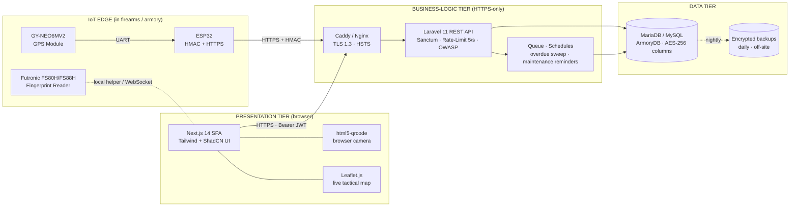

# System Architecture

## Three-Tier Web Application + IoT Edge

## Layers

1. **Presentation** – Next.js App Router with role-aware navigation, dark military theme, glassmorphism, Framer Motion micro-interactions, mobile-first responsiveness, WCAG 2.1 AA.
2. **Business Logic** – Laravel 11 controllers grouped by domain (Auth, Firearm, Transaction, GPS, Maintenance, Notification, Audit, Reports, User, Location). Strict 5 req/s rate limiter, role and clearance gates, immutable audit logger.
3. **Data** – Normalized 10-table relational schema (`ArmoryDB`). Sensitive columns (biometric template, TOTP secret, future PII) are encrypted via Laravel's `encrypted` cast (AES-256-CBC).
4. **IoT Edge** – ESP32 polls NEO-6M every 30 s, signs the JSON payload with HMAC-SHA256, and POSTs to `/api/v1/gps/ingest`. Offline buffering uses ESP32 NVS preferences.

## Cross-Cutting Concerns

| Concern | Implementation |
|---|---|
| Authentication | Sanctum bearer tokens (15 min) + TOTP + fingerprint |
| Authorization | RBAC (`role:` middleware) + Clearance (`clearance:`) |
| Confidentiality | TLS 1.3, AES-256 column encryption, HttpOnly + SameSite cookies |
| Integrity | HMAC-SHA256 IoT payloads, append-only `audit_logs` |
| Availability | Caddy load-balancer-ready, daily backups, queue retries |
| Auditability | `App\Services\AuditLogger` writes for every privileged action |
| Observability | Laravel logs + dedicated `audit_logs` + frontend Sonner toasts |
