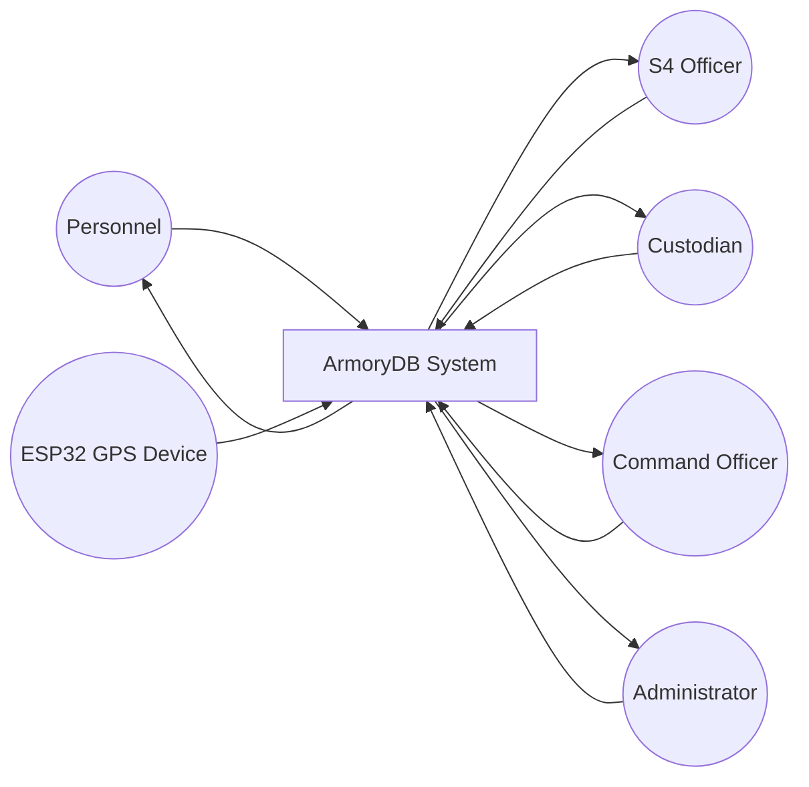
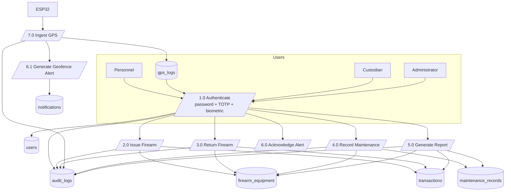
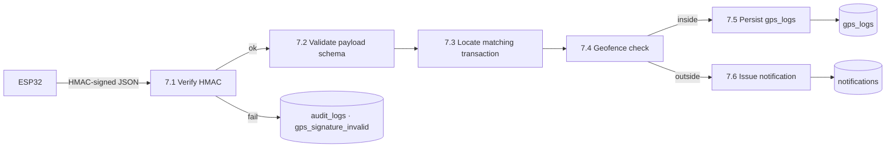

# Data Flow Diagrams

## DFD Level 0 (context)

```mermaid
flowchart LR
  P((Personnel))
  S((S4 Officer))
  C((Custodian))
  CMD((Command Officer))
  ADM((Administrator))
  ESP((ESP32 GPS Device))

  SYS[ArmoryDB System]

  P --> SYS
  S --> SYS
  C --> SYS
  CMD --> SYS
  ADM --> SYS
  ESP --> SYS

  SYS --> P
  SYS --> S
  SYS --> C
  SYS --> CMD
  SYS --> ADM
```

## DFD Level 1

```mermaid
flowchart TB
  subgraph U[Users]
    PER[Personnel] --> AUTH
    S4[S4 Officer] --> AUTH
    CUS[Custodian] --> AUTH
    ADM[Administrator] --> AUTH
  end

  AUTH[/1.0 Authenticate<br/>password + TOTP + biometric/]
  AUTH --> S1[(users)]
  AUTH --> S6[(audit_logs)]

  AUTH --> ISSUE[/2.0 Issue Firearm/]
  AUTH --> RETURN[/3.0 Return Firearm/]
  AUTH --> MAINT[/4.0 Record Maintenance/]
  AUTH --> REPORT[/5.0 Generate Report/]
  AUTH --> ALERT[/6.0 Acknowledge Alert/]

  ISSUE --> S2[(firearm_equipment)]
  ISSUE --> S3[(transactions)]
  ISSUE --> S6
  RETURN --> S2 & S3 & S6

  ESP[ESP32] --> GPS[/7.0 Ingest GPS/]
  GPS --> S4[(gps_logs)]
  GPS --> S6
  GPS --> ALERTSGEN[/6.1 Generate Geofence Alert/]
  ALERTSGEN --> S5[(notifications)]

  MAINT --> S7[(maintenance_records)]
  MAINT --> S2 & S6

  REPORT --> S2 & S3 & S6 & S7
```

## DFD Level 2 — GPS ingest

```mermaid
flowchart LR
  ESP[ESP32] -->|HMAC-signed JSON| V1[7.1 Verify HMAC]
  V1 -->|ok| V2[7.2 Validate payload schema]
  V1 -->|fail| LOG[(audit_logs · gps_signature_invalid)]
  V2 --> V3[7.3 Locate matching transaction]
  V3 --> V4[7.4 Geofence check]
  V4 -->|inside| W1[7.5 Persist gps_logs]
  V4 -->|outside| W2[7.6 Issue notification]
  W2 --> N[(notifications)]
  W1 --> S[(gps_logs)]
```
