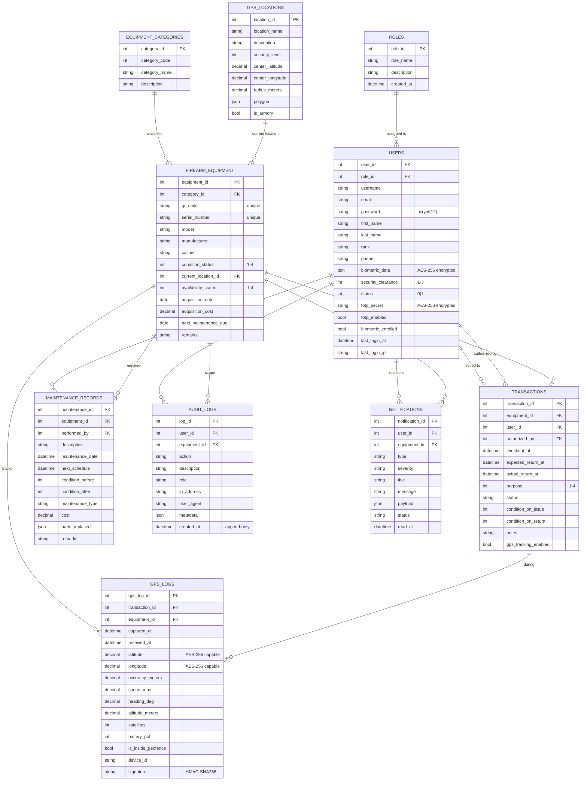

# Entity-Relationship Diagram — `ArmoryDB`

```mermaid
erDiagram
  ROLES ||--o{ USERS : "assigned to"
  USERS ||--o{ TRANSACTIONS : "issued to"
  USERS ||--o{ TRANSACTIONS : "authorized by"
  USERS ||--o{ MAINTENANCE_RECORDS : "performed by"
  USERS ||--o{ AUDIT_LOGS : "actor"
  USERS ||--o{ NOTIFICATIONS : "recipient"

  EQUIPMENT_CATEGORIES ||--o{ FIREARM_EQUIPMENT : "classifies"
  GPS_LOCATIONS        ||--o{ FIREARM_EQUIPMENT : "current location"

  FIREARM_EQUIPMENT    ||--o{ TRANSACTIONS         : "checked-out"
  FIREARM_EQUIPMENT    ||--o{ MAINTENANCE_RECORDS  : "serviced"
  FIREARM_EQUIPMENT    ||--o{ NOTIFICATIONS        : "subject"
  FIREARM_EQUIPMENT    ||--o{ GPS_LOGS             : "tracks"
  FIREARM_EQUIPMENT    ||--o{ AUDIT_LOGS           : "scope"

  TRANSACTIONS         ||--o{ GPS_LOGS             : "during"

  ROLES {
    int    role_id PK
    string role_name
    string description
    datetime created_at
  }

  USERS {
    int    user_id PK
    int    role_id FK
    string username
    string email
    string password "bcrypt(12)"
    string first_name
    string last_name
    string rank
    string phone
    text   biometric_data "AES-256 encrypted"
    int    security_clearance "1-3"
    int    status "0|1"
    string totp_secret "AES-256 encrypted"
    bool   totp_enabled
    bool   biometric_enrolled
    datetime last_login_at
    string last_login_ip
  }

  EQUIPMENT_CATEGORIES {
    int    category_id PK
    int    category_code
    string category_name
    string description
  }

  FIREARM_EQUIPMENT {
    int    equipment_id PK
    int    category_id FK
    string qr_code "unique"
    string serial_number "unique"
    string model
    string manufacturer
    string caliber
    int    condition_status "1-4"
    int    current_location_id FK
    int    availability_status "1-4"
    date   acquisition_date
    decimal acquisition_cost
    date   next_maintenance_due
    string remarks
  }

  TRANSACTIONS {
    int    transaction_id PK
    int    equipment_id FK
    int    user_id FK
    int    authorized_by FK
    datetime checkout_at
    datetime expected_return_at
    datetime actual_return_at
    int    purpose "1-4"
    string status
    int    condition_on_issue
    int    condition_on_return
    string notes
    bool   gps_tracking_enabled
  }

  MAINTENANCE_RECORDS {
    int    maintenance_id PK
    int    equipment_id FK
    int    performed_by FK
    string description
    datetime maintenance_date
    datetime next_schedule
    int    condition_before
    int    condition_after
    string maintenance_type
    decimal cost
    json   parts_replaced
    string remarks
  }

  NOTIFICATIONS {
    int    notification_id PK
    int    user_id FK
    int    equipment_id FK
    string type
    string severity
    string title
    string message
    json   payload
    string status
    datetime read_at
  }

  AUDIT_LOGS {
    int    log_id PK
    int    user_id FK
    int    equipment_id FK
    string action
    string description
    string role
    string ip_address
    string user_agent
    json   metadata
    datetime created_at "append-only"
  }

  GPS_LOCATIONS {
    int    location_id PK
    string location_name
    string description
    int    security_level
    decimal center_latitude
    decimal center_longitude
    decimal radius_meters
    json   polygon
    bool   is_armory
  }

  GPS_LOGS {
    int    gps_log_id PK
    int    transaction_id FK
    int    equipment_id FK
    datetime captured_at
    datetime received_at
    decimal latitude  "AES-256 capable"
    decimal longitude "AES-256 capable"
    decimal accuracy_meters
    decimal speed_mps
    decimal heading_deg
    decimal altitude_meters
    int    satellites
    int    battery_pct
    bool   is_inside_geofence
    string device_id
    string signature "HMAC-SHA256"
  }
```
