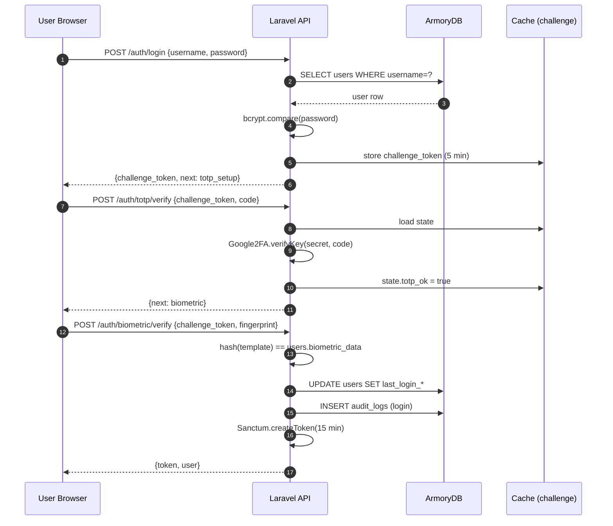
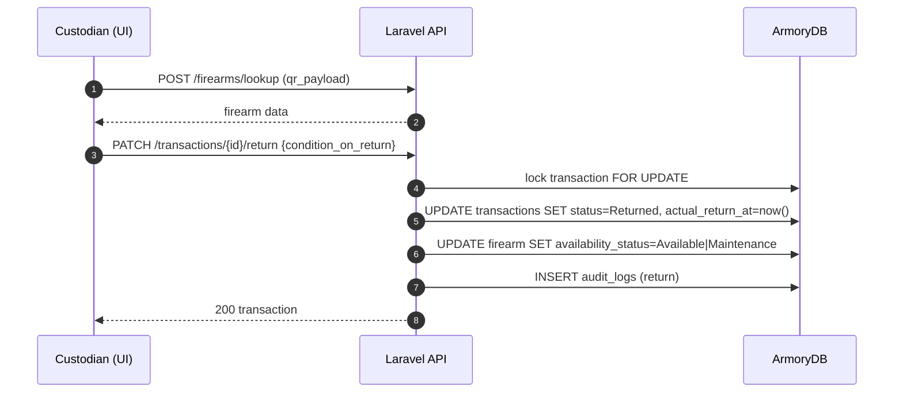
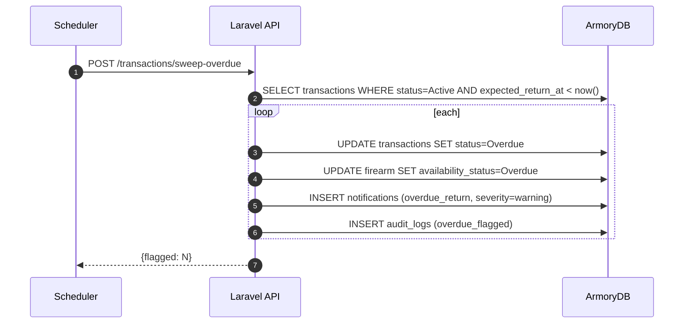

# Sequence Diagrams

## A. Authentication (3 factors)



## B. Firearm Issuance

```mermaid
sequenceDiagram
  autonumber
  participant CUS as Custodian (UI)
  participant API as Laravel API
  participant DB as ArmoryDB
  participant ESP as ESP32

  CUS->>API: POST /firearms/lookup (qr_payload)
  API->>DB: SELECT firearm_equipment
  DB-->>API: firearm row
  API-->>CUS: firearm data

  CUS->>API: POST /transactions/issue
  API->>DB: BEGIN; lock firearm_equipment FOR UPDATE
  DB-->>API: status = Available
  API->>DB: INSERT transactions (Active)
  API->>DB: UPDATE firearm SET availability=2
  API->>DB: INSERT audit_logs (issuance)
  DB-->>API: COMMIT
  API-->>CUS: 201 transaction

  ESP->>API: POST /gps/ingest (every 30 s, signed)
  API->>DB: INSERT gps_logs
  API->>API: geofence check
  API-->>ESP: 200 ok
```

## C. Firearm Return



## D. Overdue Sweep (scheduled)


