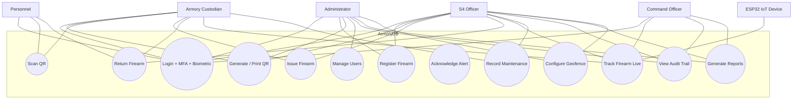

# Use Cases

## Use-Case Descriptions

### UC-1 · Login + MFA + Biometric
| Actor   | Pre-condition | Main flow | Alt-flow |
|---|---|---|---|
| All authorized users | URL reachable, account active | 1. POST `/auth/login` (user/pass) → challenge token  · 2. POST `/auth/totp/verify` (6-digit) · 3. POST `/auth/biometric/verify` (template) → Sanctum token | After 3 failed pwd → reCAPTCHA. Wrong TOTP → reset step 2. Biometric mismatch → reset step 3. |

### UC-5 · Issue Firearm (S4 / Custodian)
1. Authenticate (UC-1).
2. Scan firearm QR (UC-4).
3. Select personnel and purpose; set expected return.
4. POST `/transactions/issue`.
5. System updates firearm to *Checked Out* and starts GPS tracking.
6. Audit log written automatically.

### UC-6 · Return Firearm
1. Authenticate.
2. Scan firearm QR.
3. PATCH `/transactions/{id}/return` with condition.
4. System sets *Returned*; if condition ≥ Fair, status becomes *Maintenance*.
5. GPS tracking deactivated. Audit log written.

### UC-7 · Track Firearm Live
1. ESP32 sends signed GPS payload every 30 s.
2. `/gps/ingest` validates HMAC, geofence, persists.
3. UI calls `/gps/live` every 30 s; markers move on Leaflet map.
